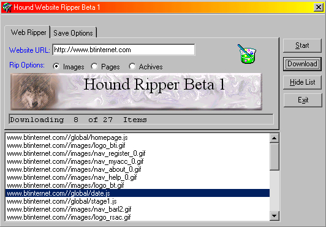



## Hound WebRipper Beta 1

### Description

Hound Web Ripper is a small project I made to rip picture and pages form websites. and the best thing about the program that it does not use the webbowser control Like a lot on here i have seen before. Just uses the Inet control. Please have a look and tell us what you thing I wil all be updateing it soon with some cool new functions.

at this time the project will only rips the only page and what evers on that page. but its quit cool
 
### More Info
 

             |
---                |---
**Submitted On**   |2000-09-03 04:30:42
**By**             |[dreamvb](https://github.com/Planet-Source-Code/PSCIndex/blob/master/ByAuthor/dreamvb.md)
**Level**          |Intermediate
**User Rating**    |4.8 (19 globes from 4 users)
**Compatibility**  |VB 6\.0
**Category**       |[Complete Applications](https://github.com/Planet-Source-Code/PSCIndex/blob/master/ByCategory/complete-applications__1-27.md)
**World**          |[Visual Basic](https://github.com/Planet-Source-Code/PSCIndex/blob/master/ByWorld/visual-basic.md)
**Archive File**   |[CODE\_UPLOAD9544922000\.zip](https://github.com/Planet-Source-Code/dreamvb-hound-webripper-beta-1__1-11203/archive/master.zip)

